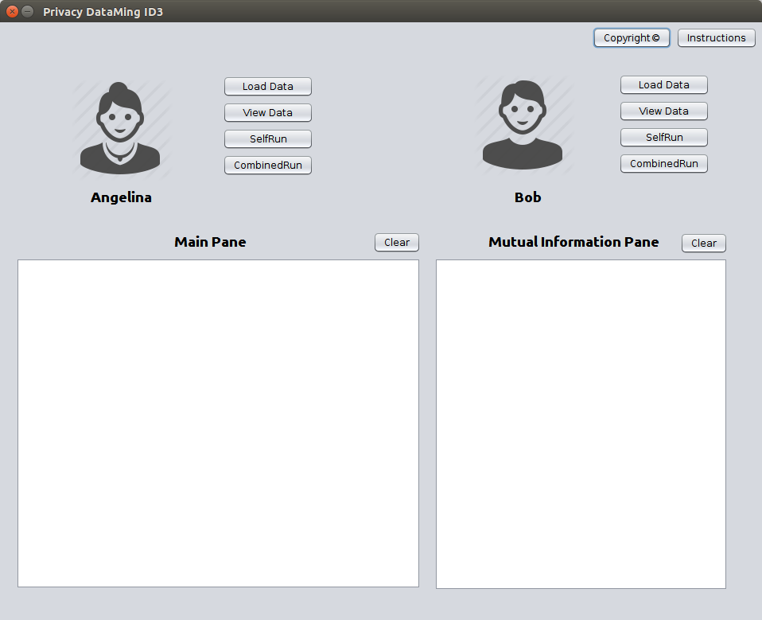

# Two-party Jointly Decision Tree Algorithm

An extended version of decision tree for privacy data mining



## Download ##

The whole project can be download from: 
[https://github.com/monaen/PrivacyDecisionTree](https://github.com/monaen/PrivacyDecisionTree)

## Requirements ##
java JDK >= 1.8.0

## Features ##

* Extend the traditional ID3 algorithm to two-party jointly build situation.
* Can fit the privacy situation better.

## Drawbacks ##

* Can only implement on the dataset which only contains two target classes.
* Cannot deal with the case of missing value of attribute.
* Data structure is space-consuming.

## Contributors ##

* [Nan Meng](http://naenmong.com)


## How to use ##
##### Download from github
Run `git clone https://github.com/monaen/PrivacyDecisionTree.git`

##### Run the project at local
```
cd PrivacyDecisionTree/src
javac PrivacyID3.java
java PrivacyID3
```
## Algorithm illustration ##
* [Privacy Decision Tree Algorithm](http://monaen.github.io/PrivacyDecisionTree)


